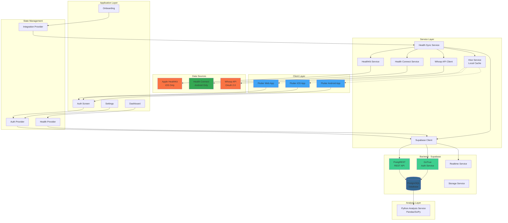
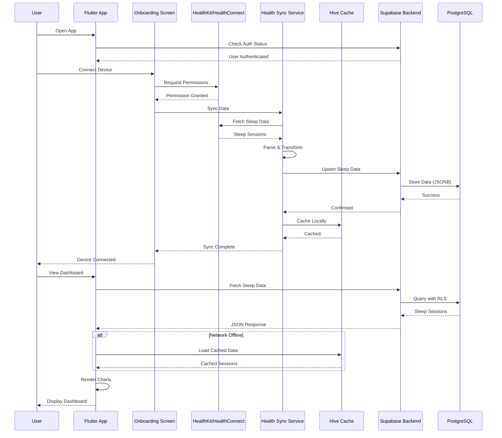
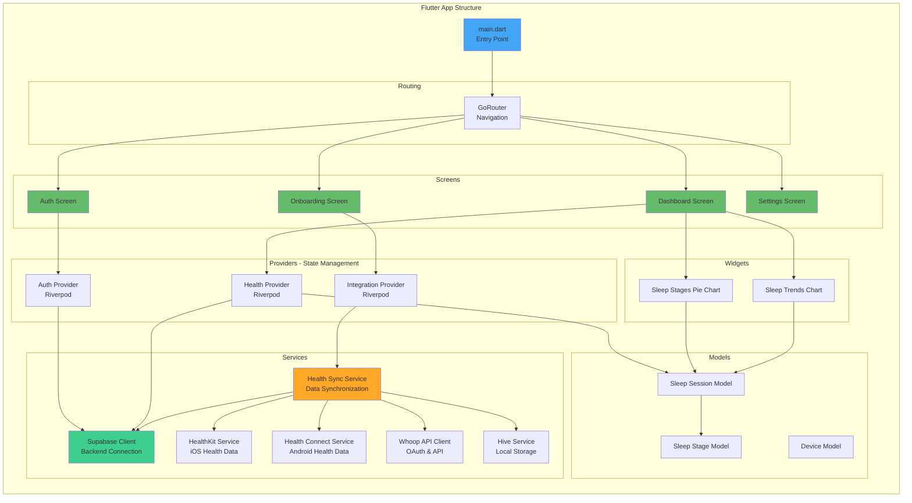
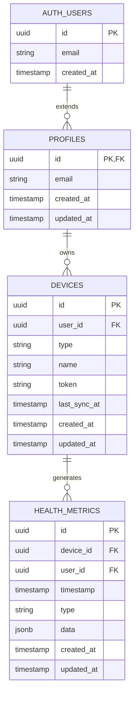
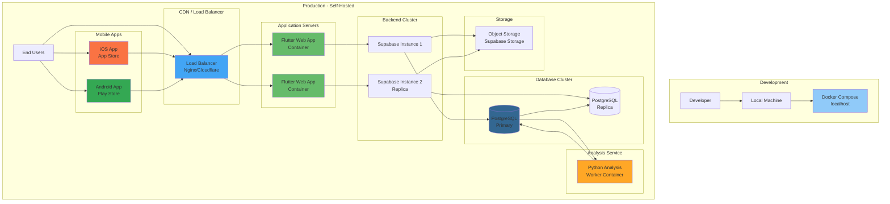
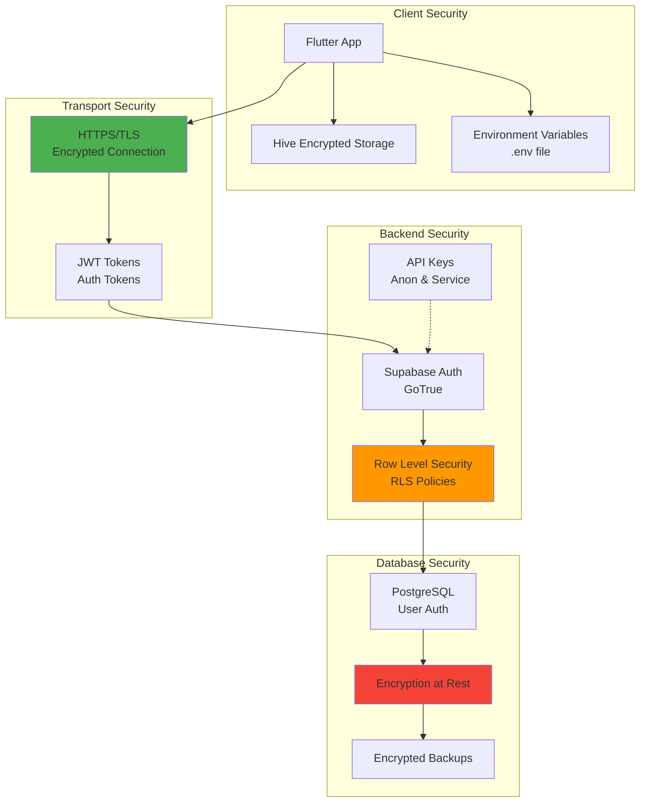
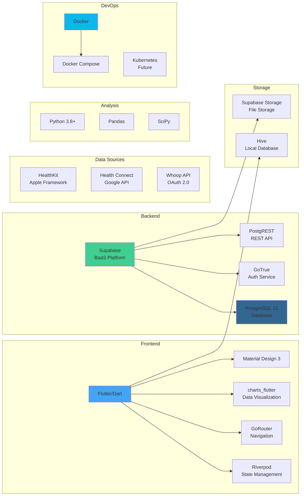
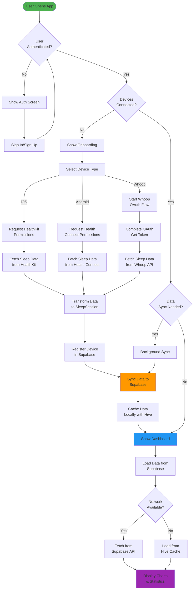

# Architecture Documentation

## System Architecture

### High-Level Architecture

## Data Flow Architecture

## Component Architecture

## Database Schema

## Deployment Architecture

## Security Architecture

## Technology Stack

## Data Synchronization Flow

## Key Design Decisions

1. **Self-Hosted Supabase**: Users control their data, no reliance on third-party services
2. **Row Level Security (RLS)**: Database-level security ensures data isolation
3. **Offline-First**: Hive caching allows app to work without network
4. **Cross-Platform**: Single Flutter codebase for Web, iOS, and Android
5. **Privacy-First**: No analytics, no data selling, encryption at rest
6. **Extensible**: Easy to add new data sources (Fitbit, Garmin, etc.)

## Performance Considerations

- **Client-Side Caching**: Hive reduces API calls
- **Batch Syncing**: Multiple sleep sessions synced in batches
- **Lazy Loading**: Data loaded on-demand in providers
- **Database Indexing**: Optimized queries with proper indexes
- **Connection Pooling**: Supabase handles connection management
- **CDN Ready**: Static assets can be served via CDN for web

